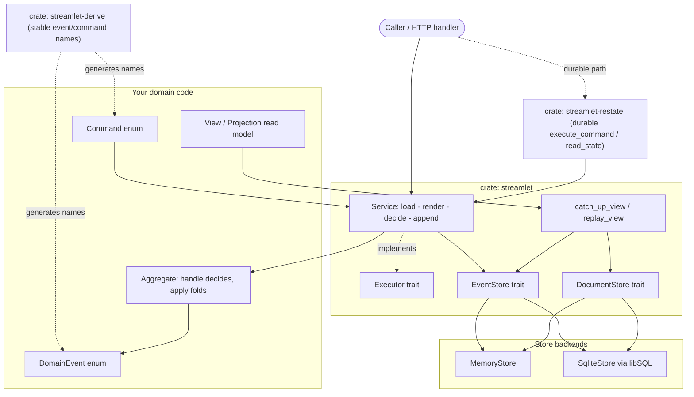
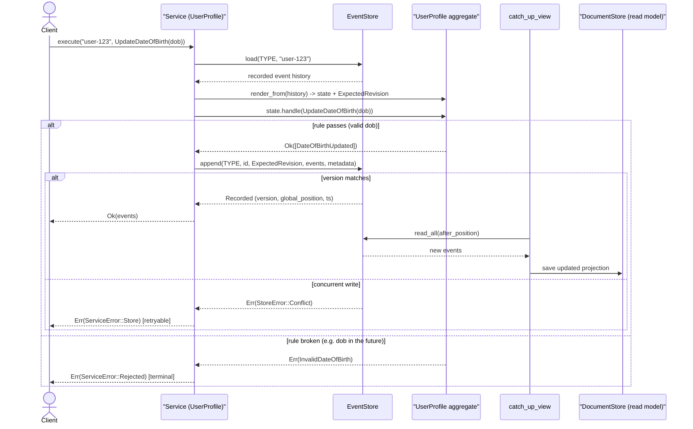

# streamlet

A small, ergonomic event-sourcing toolkit for Rust. The whole model fits in your
head: **events** are things that happened, **commands** are things you want to
happen, **aggregates** decide one from the other, **stores** persist the events,
and a typed **service** wires it all together. Derive macros keep your domain
enum names consistent automatically, and the same business logic runs in-process
or durably on [Restate](https://restate.dev).

## Architecture



## Example: updating a value end-to-end

A single command flows through one predictable path. Business rejections and
infrastructure failures stay on separate arms the whole way through (here shown
with a hypothetical `UserProfile` aggregate updating a date of birth):



## Workspace layout

| Crate | What it is |
| --- | --- |
| [`crates/streamlet`](crates/streamlet) | The core toolkit: `DomainEvent`, `Command`, `Aggregate`, `View`, `EventStore`, `DocumentStore`, `Service`, `Executor`, projections, the in-memory store and the libSQL store. |
| [`crates/streamlet-derive`](crates/streamlet-derive) | `#[derive(DomainEvent)]` and `#[derive(Command)]` proc-macros that give every enum variant a stable name (with optional `prefix` / `rename`). |
| [`crates/streamlet-restate`](crates/streamlet-restate) | Run the same `Service` durably inside a Restate handler, preserving the rejection / infrastructure error split. |
| [`examples/counter`](examples/counter) | A runnable in-process counter demo (memory + optional libSQL). |
| [`examples/restate-counter`](examples/restate-counter) | The same counter exposed as a Restate Virtual Object. |

## Core concepts

```rust
use streamlet::prelude::*;
use serde::{Serialize, Deserialize};

// Events — the derive gives each variant a stable name like "counter.Incremented".
#[derive(Clone, Serialize, Deserialize, DomainEvent)]
#[domain_event(prefix = "counter.")]
enum CounterEvent { Incremented { by: i64 }, Reset }

// Commands — likewise named automatically.
#[derive(Command)]
enum CounterCommand { Increment(i64), Reset }

#[derive(Default)]
struct Counter { value: i64 }

// Business-rule rejection — deliberately *not* an infrastructure error.
#[derive(Debug, thiserror::Error)]
#[error("counter would overflow")]
struct Overflow;

impl Aggregate for Counter {
    type Command = CounterCommand;
    type Event = CounterEvent;
    type Rejection = Overflow;
    const TYPE: &'static str = "counter";

    fn handle(&self, cmd: CounterCommand) -> Result<Vec<CounterEvent>, Overflow> {
        match cmd {
            CounterCommand::Increment(by) => {
                self.value.checked_add(by).ok_or(Overflow)?;
                Ok(vec![CounterEvent::Incremented { by }])
            }
            CounterCommand::Reset => Ok(vec![CounterEvent::Reset]),
        }
    }

    fn apply(&mut self, event: &CounterEvent) {
        match event {
            CounterEvent::Incremented { by } => self.value += by,
            CounterEvent::Reset => self.value = 0,
        }
    }
}
```

### The typed service

Declare a `Service` once for an aggregate; from then on the type system only lets
you feed it that aggregate's commands, and it loads/renders/decides/appends for
you:

```rust
let service = Service::<Counter, _>::new(MemoryStore::new());

// Exactly the commands this service handles — nothing more:
assert_eq!(
    Service::<Counter, MemoryStore>::handled_commands(),
    &["Increment", "Reset"],
);

service.execute("counter-1", CounterCommand::Increment(5)).await?;
```

### Rejections vs. infrastructure errors

Every `execute` returns `Result<_, ServiceError<R>>`, which keeps the two failure
modes apart:

```rust
match service.execute(id, command).await {
    Ok(events) => { /* committed */ }
    Err(ServiceError::Rejected(rule)) => { /* domain said no; don't retry */ }
    Err(ServiceError::Store(err))     => { /* plumbing failed; maybe retry */ }
}
```

### Rendering & projections

Folding events into state is "rendering". Aggregates render themselves; read
models implement `View` and are rebuilt with `replay_view` or kept up to date
incrementally with `catch_up_view` (which persists the result via a
`DocumentStore`).

## Stores

Both stores implement `EventStore` **and** `DocumentStore` and pass the same
[conformance suite](crates/streamlet/tests/store_conformance.rs):

* **`MemoryStore`** (feature `memory`, on by default) — everything in a `Mutex`;
  perfect for tests.
* **`SqliteStore`** (feature `libsql`) — persistence via
  [libSQL](https://github.com/tursodatabase/libsql). Strictly append-only events,
  optimistic concurrency enforced by a `UNIQUE(aggregate_type, stream_id,
  version)` index, a monotonic `global_position` for projections, plus document
  storage.

```rust
let store = SqliteStore::open("events.db").await?;   // or ::open_in_memory()
let service = Service::<Counter, _>::new(store);
```

## Restate (durable execution)

The `streamlet-restate` crate lets the *same* aggregate run through Restate's
durable executor. A handler wraps the service call in `ctx.run(..)` using the
journaled-action builders:

```rust
async fn increment(&self, ctx: ObjectContext<'_>, amount: i64) -> Result<i64, HandlerError> {
    let id = ctx.key().to_string();
    let service = self.service.clone();
    ctx.run(|| execute_command(service.clone(), id.clone(), CounterCommand::Increment(amount))).await?;
    let Json(value) = ctx.run(|| read_state(service, id, |c: &Counter| c.value)).await?;
    Ok(value)
}
```

Business rejections become a Restate `TerminalError` (no retries); store failures
stay retryable `HandlerError`s — so the rejection / infrastructure split survives
all the way through the durable path.

## Running it

```bash
# In-process counter demo (memory store)
cargo run -p counter-example --bin counter

# ...and also against the persistent libSQL store
cargo run -p counter-example --bin counter --features libsql

# Tests across both store implementations
cargo test -p streamlet --features libsql

# Restate counter endpoint
cargo run -p restate-counter-example --bin restate-counter
# then, with a running Restate server:
#   restate deployments register http://localhost:9080
#   curl localhost:8080/CounterObject/my-counter/increment --json '5'
#   curl localhost:8080/CounterObject/my-counter/get
```

## Feature flags (`streamlet`)

| Feature | Default | Effect |
| --- | --- | --- |
| `memory` | yes | The in-memory `MemoryStore`. |
| `libsql` | no | The libSQL-backed `SqliteStore`. |

## Building from source

A standard Rust toolchain (1.80+) works out of the box. The `libsql` feature
compiles libSQL's bundled SQLite C core, so a C compiler must be available
(MSVC Build Tools on Windows, or `gcc`/`clang` elsewhere).

## License

MIT OR Apache-2.0.
